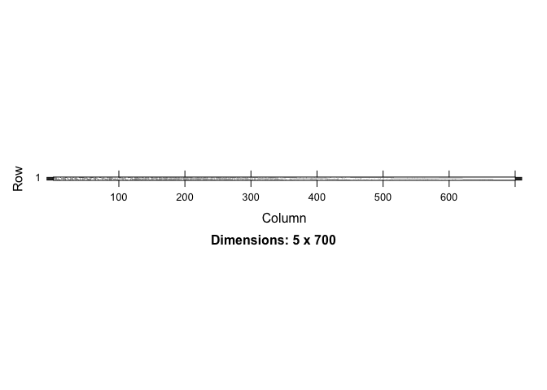
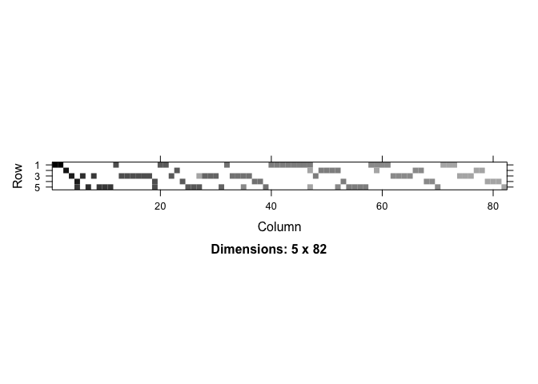
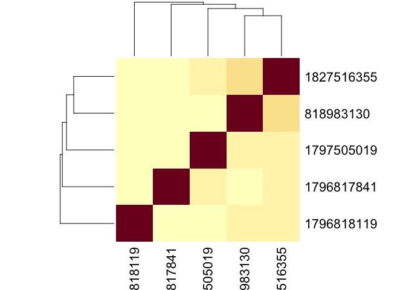
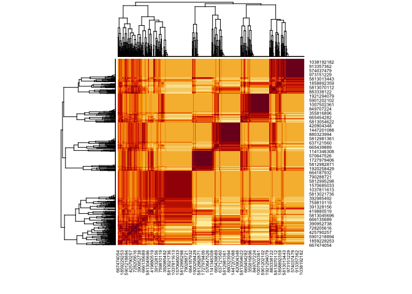

<!-- README.md is generated from README.Rmd. Please edit that file -->
<!-- devtools::build_readme() -->
<!-- badges: start -->

[](https://github.com/natverse/coconat/actions/workflows/R-CMD-check.yaml)
[](https://app.codecov.io/gh/natverse/coconat?branch=master)
[](https://lifecycle.r-lib.org/articles/stages.html#experimental)
<!-- badges: end -->

The goal of *coconat* is to provide dataset agnostic support for
connectome analysis.

It is intended to have a mix of end-user functionality and functions
that are principally intended as building blocks for more specialised
packages such as <https://natverse.org/neuprintr/> or
<https://natverse.org/fafbseg/>

## Installation

You can install the development version of coconat from
[GitHub](https://github.com/) with:

``` r
# install.packages("devtools")
devtools::install_github("natverse/coconat")
```

## Example

This is a basic example which shows you how to solve a common problem:

``` r
library(coconat)
# da2ds=neuprintr::neuprint_connection_table('DA2_lPN', details=TRUE, partners='out', conn = hbconn)
da2ds=readRDS(system.file('sampledata/da2ds.rds', package = 'coconat'))
head(da2ds)
#>       bodyid    partner prepost weight      name    type
#> 1 1796817841 5812982273       1     28   KCg-m_R   KCg-m
#> 2 1796817841  574377845       1     28 LHAV3f1_R LHAV3f1
#> 3 1797505019 1202410042       1     27   KCg-m_R   KCg-m
#> 4 1796818119  632402333       1     26   KCg-m_R   KCg-m
#> 5 1827516355 5813055865       1     26 LHAD1f2_R LHAD1f2
#> 6 1796818119 5813080766       1     24   KCg-m_R   KCg-m
```

``` r
library(Matrix)
am=partner_summary2adjacency_matrix(da2ds, inputcol = 'bodyid', outputcol = 'partner')
image(am)
```



``` r

am2=partner_summary2adjacency_matrix(subset(da2ds, weight>=15), 
                                     inputcol = 'bodyid', outputcol = 'partner')
image(am2)
```

 Now
we can also cosine cluster

We can do this for the inputs (the 5 PNs should look much the same)

``` r
heatmap(cosine_sim(am, transpose = T))
```



Or the outputs

``` r
heatmap(cosine_sim(am))
```



But it would of course be more useful if we did this based on a richer
set of inputs
